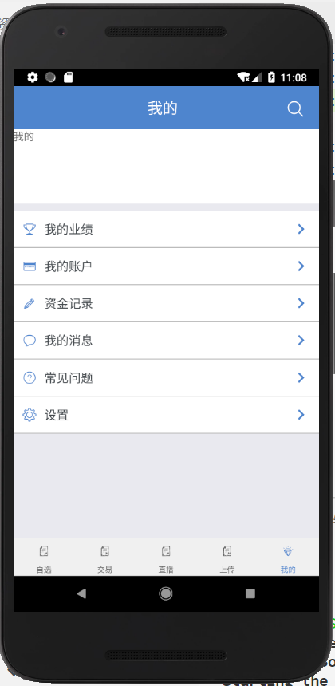

### 安装及运行
- npm install
- react-native link
- react-native log-android
- react-native run-android

### Android高版本gradlew配置
- app/android/build.gradle
```
buildscript {
    repositories {
        jcenter()
        google()
    }
    dependencies {
        classpath 'com.android.tools.build:gradle:3.1.2'
    }
}

allprojects {
    repositories {
        mavenLocal()
        jcenter()
        maven {
            url "$rootDir/../node_modules/react-native/android"
        }
        google()
    }
}
```

- app/android/gradle.properties
android.enableAapt2=false 打线上包的时候再加上
```
android.useDeprecatedNdk=true
# android.enableAapt2=false
```

- app/android/app/build.gradle
```
android {
    compileSdkVersion 26
    defaultConfig {
        applicationId "com.app"
        minSdkVersion 16
        targetSdkVersion 26
        versionCode 1
        versionName "1.0"
        // ...
    }
    // ...
}
dependencies {
    // ...
    implementation "com.android.support:appcompat-v7:26.1.0"
    // ...
}
```

- app/android/gradle/wrapper/gradle-wrapper.properties
```
    distributionUrl=https\://services.gradle.org/distributions/gradle-4.5-all.zip
    android.enableAapt2=false
```


#### 参考阅读
- https://react-native-training.github.io/react-native-elements/
- https://oblador.github.io/react-native-vector-icons/
- 
- https://stackoverflow.com/questions/45954209/issues-with-resources-generated-by-react-in-android-studio-3

### Android打包步骤

Android使用gradle进行打包
gradlew是gradle的包装工具。解决不同项目间依赖的gradle版本不一致的问题。  

tip: mac环境下使用 ./gradlew 命令  window环境下使用gradlew 命令
```
$ cd ~/xx/rn-project/android
$ ./gradlew clean  //清除已打出的包
$ ./gradlew build  
$ cd ~/xx/rn-project/android/app/build/outputs/apk  //构建生成的地址

```

./gradlew build 会默认打出所有类型的包 (debug、release)
./gradlew installDebug


#### 如何根据需要打指定类型的包?
```
./gradlew assemble <productFlavor><buildType>  
```
<productFlavor> 为多渠道的产品名，现阶段可以不使用  
<buildType> Release 、Debug

```
./gradlew assembleDebug
./gradlew assembleRelease
```

### 签名
Android应用是通过包名进行区分。如何防止别的应用通过修改包名来伪造本应用？那么就需要对打出的apk包进行签名。

#### 如何打签名包？
##### 1.创建 key store。  
需要使用keytool，该工具在jdk/bin下  
使用以下命令创建
```
keytool -genkey -alias aliasXXX -keyalg RSA -validity 20000 -keystore path/to/keysotre/xxx.jks 
```
-alias 为key别名  
-keyalg 为加密算法   
-validity 为签名的有效期(单位天)   
-keystore 指定生成jks存放的路径


##### 2. 配置签名
打开 ~/xx/rn-project/android/app/build.gradle  
在android模块中添加
```
signingConfigs {
    release {
        storeFile file(rootDir.getAbsolutePath() + '/xxx.jks')
        storePassword "123456"
        keyAlias "aliasXXX"
        keyPassword "123456"
    }
}

buildTypes {
    release {
        minifyEnabled enableProguardInReleaseBuilds
        proguardFiles getDefaultProguardFile("proguard-android.txt"), "proguard-rules.pro"
        signingConfig signingConfigs.release //此行新增
    }
}
```

3. 打出签名的release包
```
./gradlew assembleRelease
```

### 预览
- 首页

- 设置

- 上传
